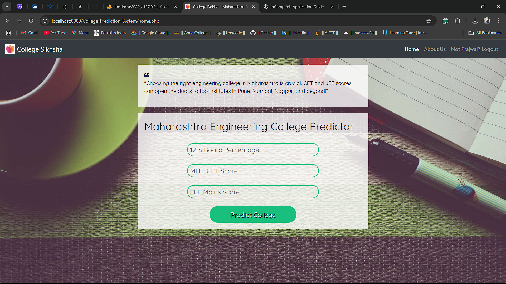
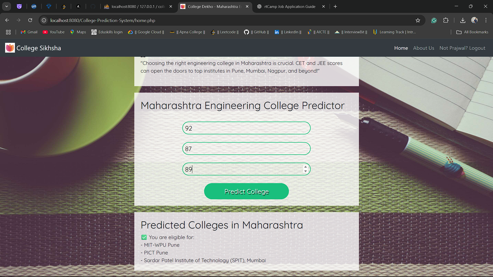

# 🎓 College Dekho – Pune College Predictor (CET & JEE Based)

College Dekho is a smart and simple **college prediction system** designed to help students find the best-fit colleges in **Pune** based on their **CET and JEE ranks**. This tool provides students with an idea of which colleges they are eligible for and increases transparency during the admission process.

## 🚀 Features

- 🎯 Predict college options based on CET or JEE rank
- 📍 Focused on Pune region colleges
- 🧮 Backend powered by PHP & MySQL
- 💻 User-friendly web interface with HTML, CSS & JavaScript
- 🔐 Secure login system for students

## 🏗️ Tech Stack

| Technology | Description |
|------------|-------------|
| **HTML/CSS** | Frontend structure and styling |
| **JavaScript** | Dynamic UI interaction |
| **PHP** | Backend logic and database interaction |
| **MySQL** | Database to store cutoff and user data |
| **XAMPP** | Local server setup |

## 📸 Screenshots
**HOME PAGE**

**PREDICTION RESULT**

**LOGIN PAGE**

## 🧠 How It Works

1. User enters CET or JEE rank.
2. System queries the database for colleges in Pune where the user's rank is eligible based on previous cutoffs.
3. Results are displayed in a ranked format with college names, courses, and eligibility status.
